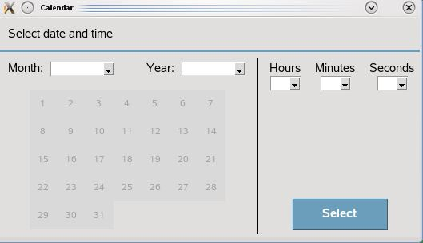
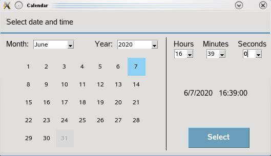

# Calendar
This is a calendar widget made for python3 programs that use tkinter module.

## Screenshot



## Example
```python
from tkinter import Tk

from calendar_widget import *

root = Tk()
calendar = CalendarWidget(root)
root.mainloop()
date_time = calendar.get_date_time()
# the keys are: 'year', 'month', 'day', 'hour', 'minutes' and 'seconds'
if date_time:
    year = date_time['year']
    month = date_time['month']
    day = date_time['day']

    date = year + '_' + month + '_' + day

    hour = date_time['hour']
    minutes = date_time['minutes']
    seconds = date_time['seconds']

    time = hour + ':' + minutes + ':' + seconds

    print(date + ' ' + time)
```



Result: 
>2020_06_07 16:39:00

## Created by
[Eugeny Khanchin](https://github.com/eKhanchin/)
